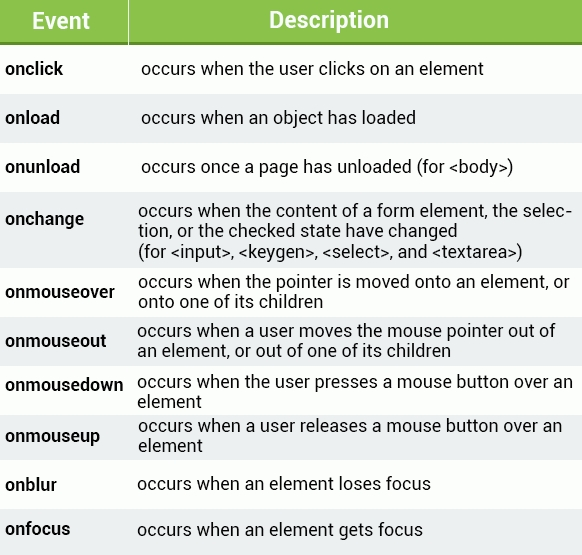

# SoloJS
(Based on SoloLearn training)

## Working with DOM elements
---
Working with DOM
Each element in the DOM has a set of properties and methods that provide information about their relationships in the DOM:
- ***element.childNodes*** returns an array of an element's child nodes.
- ***element.firstChild*** returns the first child node of an element.
- ***element.lastChild*** returns the last child node of an element.
- ***element.hasChildNodes*** returns true if an element has any child nodes, otherwise false.
- ***element.nextSibling*** returns the next node at the same tree level.
- ***element.previousSibling*** returns the previous node at the same tree level.
element.parentNode returns the parent node of an element.

### Creating Elements


Use the following methods to create new nodes:
- ***element.cloneNode()*** clones an element and returns the resulting node.
- ***document.createElement(element)*** creates a new element node.
- ***document.createTextNode(text)*** creates a new text node.


### Events



---
## Examples

### Selecting Elements

```
//finds element by id
document.getElementById(id) 
```

```
//finds elements by class name
document.getElementsByClassName(name) 
```

```
//finds elements by tag name
document.getElementsByTagName(name)
```

```
var elem = document.getElementById("demo");
```

```
elem.innerHTML = "Hello World!";
```

### Creating Elements
```
var node = document.createTextNode("Some new text");
```
This will create a new text node, but it will not appear in the document until you append it to an existing element with one of the following methods:
- ***element.appendChild(newNode)*** adds a new child node to an element as the last child node.
- ***element.insertBefore(node1, node2)*** inserts node1 as a child before node2. 
